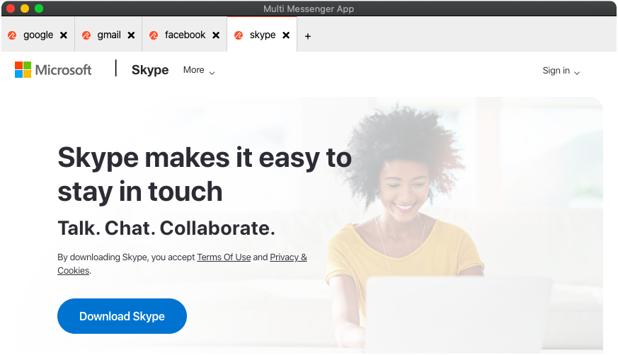

# Multi messenger app

Open multiple session of the same web application. Build with React & Electron.

# Demo

<p align="center">

</p>

## Steps to Run the Open Source Project

Use the below commands to clone the project and enter inside the project directory

```
git clone git@github.com:recraftrelic/multi-messenger-app.git
cd multi-messenger-app
```

And then install the dependencies with yarn.

```bash
$ yarn
```

## Starting Development

Start the app in the `dev` environment. This starts the renderer process in [**hot-module-replacement**](https://webpack.js.org/guides/hmr-react/) mode and starts a webpack dev server that sends hot updates to the renderer process:

```bash
$ yarn dev
```

## Packaging for Production

To package apps for the local platform:

```bash
$ yarn package
```

# Contributors

- [manojsinghnegiwd](https://github.com/manojsinghnegiwd) - Manoj Singh Negi
- [yashkapoor8710](https://github.com/yashkapoor8710) - Yogesh Kapoor

# Sponsors

[](http://www.recraftrelic.com)
